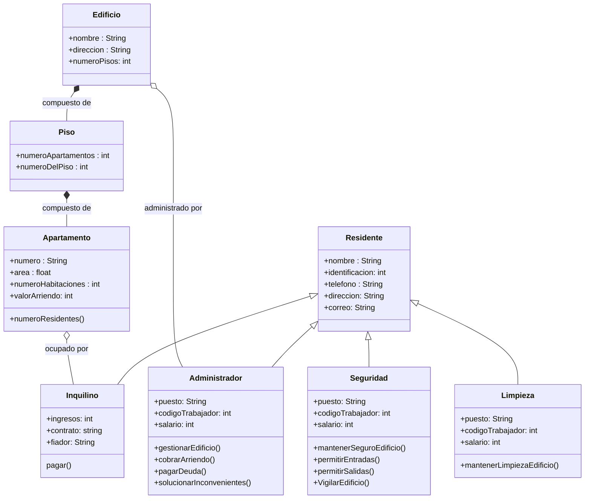

# Reto2-POO-grupo-4

Para este reto, se eligió el caso de un edificio de apartamentos, modelado con clases como "Piso", "Apartamento" y clases específicas (heredadas de una clase general "Residente") para representar a las personas que pueden interactuar de manera cotidiana con el edificio, como los inquilinos y los trabajadores.

